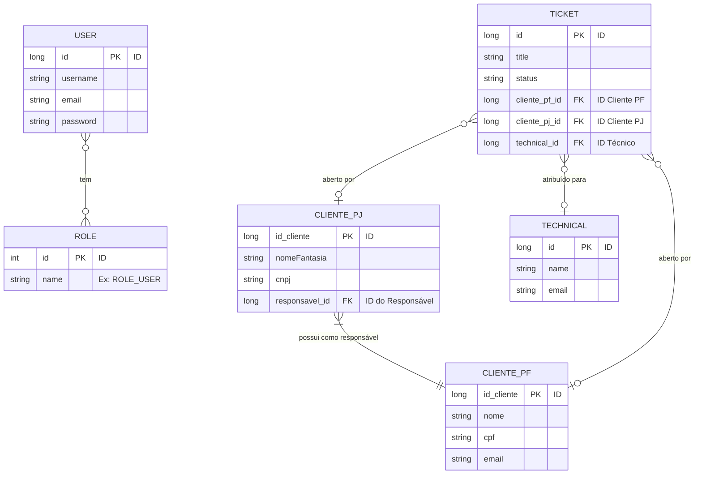

# Modelo do Banco de Dados Antigo (BD-OLD.md)

## Visão Geral

Este documento descreve a estrutura do banco de dados existente antes da refatoração. O modelo é centrado em `ClientePf` (Pessoa Física) e `ClientePJ` (Pessoa Jurídica), com uma entidade separada para `Technical` (Técnicos).

## Diagrama de Entidade e Relacionamento (DER) - Antigo

## Detalhamento das Entidades

### `User`

Usuário genérico do sistema, usado principalmente para autenticação.

-   `id`, `username`, `email`, `password`.

### `Role`

Papéis de usuário.

-   `id`, `name` (Ex: `ROLE_USER`, `ROLE_ADMIN`, `ROLE_MODERATOR`).

### `ClientePf`

Representa um cliente pessoa física.

-   `id_cliente`, `nome`, `cpf`, `endereco`, `telefone`, `email`.

### `ClientePJ`

Representa um cliente pessoa jurídica.

-   `id_cliente`, `nomeFantasia`, `cnpj`, `razaoSocial`.
-   Possui uma relação de `responsavel_id` com `ClientePf`.

### `Technical`

Representa um técnico.

-   `id`, `name`, `email`, `phone`.

### `Ticket`

Representa um chamado de suporte.

-   `id`, `title`, `description`, `status`, `priority`.
-   Pode ser associado a um `ClientePf` ou a um `ClientePJ`.
-   Pode ser atribuído a um `Technical`.
