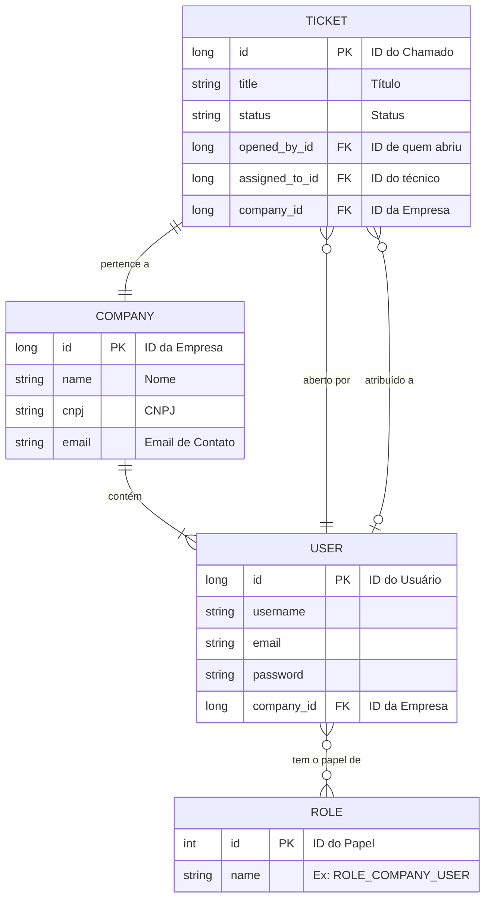

# Modelo do Banco de Dados (BD.md)

## Visão Geral

Este documento descreve a nova estrutura do banco de dados para o sistema TAS, projetada para ser mais abstrata e alinhar-se com as novas regras de negócio. O modelo antigo, baseado em `ClientePf` e `ClientePJ`, será substituído por uma estrutura centrada em `Company` e `User`.

## Diagrama de Entidade e Relacionamento (DER) - Proposta

## Detalhamento das Entidades

### `Company`

Armazena informações sobre as empresas clientes.

-   `id`: Identificador único da empresa.
-   `name`: Nome da empresa.
-   `cnpj`: CNPJ da empresa.
-   `address`: Endereço da empresa.
-   `phone`: Telefone de contato.
-   `email`: Email de contato.

### `User`

Representa qualquer usuário do sistema, seja ele um `CompanyUser`, `TechUser` ou `Moderator`. O papel do usuário definirá suas permissões.

-   `id`: Identificador único do usuário.
-   `username`: Nome de usuário para login.
-   `email`: Email do usuário.
-   `password`: Senha (hash).
-   `company_id`: Chave estrangeira para a `Company` à qual o usuário pertence. Pode ser nulo para usuários `Moderator` ou `TechUser` que não são vinculados a uma empresa cliente específica.

### `Role`

Define os papéis (perfis de acesso) do sistema.

-   `id`: Identificador único do papel.
-   `name`: Nome do papel (Ex: `ROLE_COMPANY_USER`, `ROLE_TECH_USER`, `ROLE_MODERATOR`).

### `User_Roles`

Tabela de associação entre `User` e `Role`.

### `Ticket`

Representa um chamado de suporte.

-   `id`: Identificador único do chamado.
-   `title`: Título do chamado.
-   `description`: Descrição detalhada do problema.
-   `status`: Status atual do chamado (Ex: `OPEN`, `IN_PROGRESS`, `RESOLVED`, `CLOSED`).
-   `priority`: Prioridade do chamado (Ex: `LOW`, `MEDIUM`, `HIGH`).
-   `opened_by_id`: Chave estrangeira para o `User` que abriu o chamado.
-   `assigned_to_id`: Chave estrangeira para o `TechUser` a quem o chamado foi atribuído.
-   `company_id`: Chave estrangeira para a `Company` dona do chamado.
-   `created_at`: Data e hora da criação do chamado.
-   `resolved_at`: Data e hora da resolução do chamado.
-   `resolution_notes`: Notas sobre a resolução do problema.
-   `rating`: Avaliação do chamado (1 a 5 estrelas).

## Próximos Passos

1.  **Excluir as classes de modelo antigas:** `ClientePf`, `ClientePJ` e `Technical`.
2.  **Criar a nova classe de modelo:** `Company`.
3.  **Refatorar as classes de modelo:** `User`, `Role`, `ERole` e `TicketModel` para refletir a nova estrutura.
4.  **Atualizar os Repositórios, Serviços e Controladores** para se alinharem com o novo modelo.
5.  **Criar uma migração de banco de dados** (se estivéssemos usando uma ferramenta como Flyway ou Liquibase) ou ajustar o `data.sql` para popular o banco com os novos papéis e dados de exemplo.
